# Gmail UI Clone

Gmail Application UI Clone in Flutter

<p align="center">
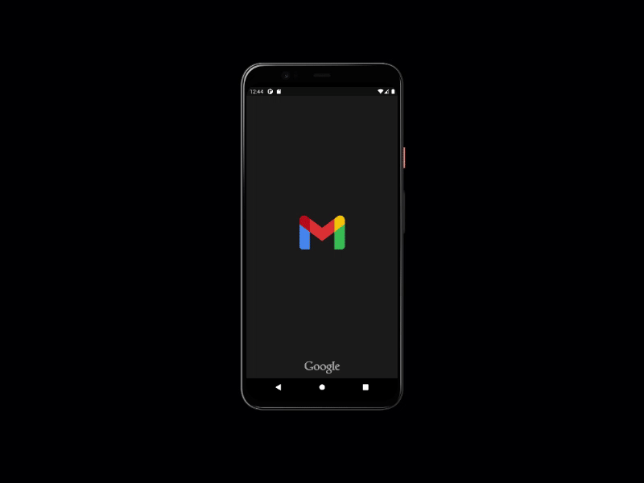
</p

## APK

[⬇️ Download apk here](https://github.com/Yogeshk4124/Gmail-ui-clone/blob/main/apk/app.apk?raw=true)

## Screenshots

### Dark mode

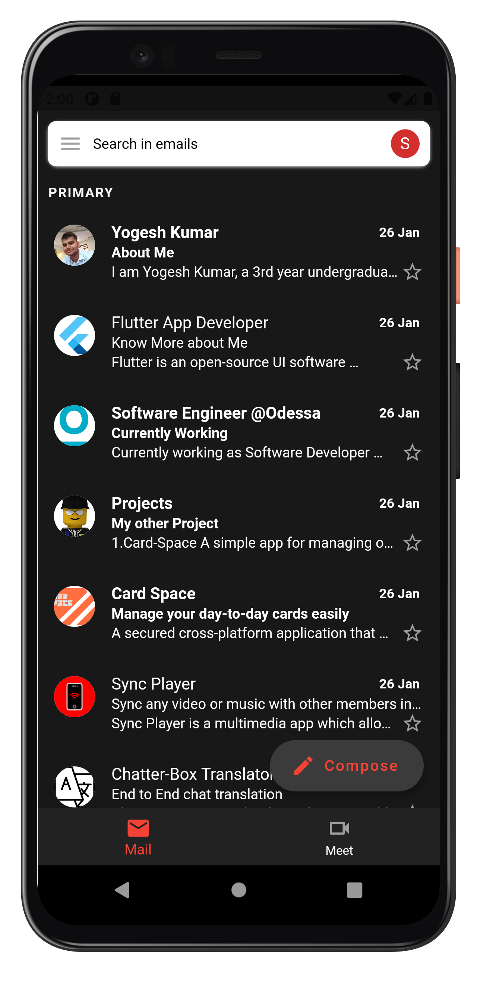 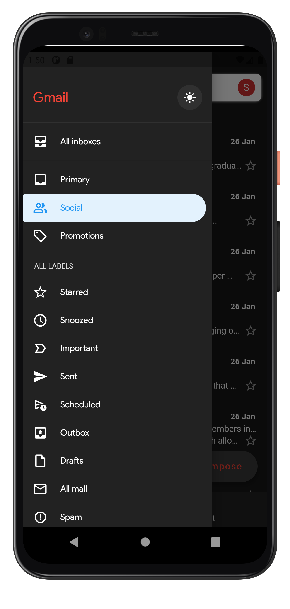 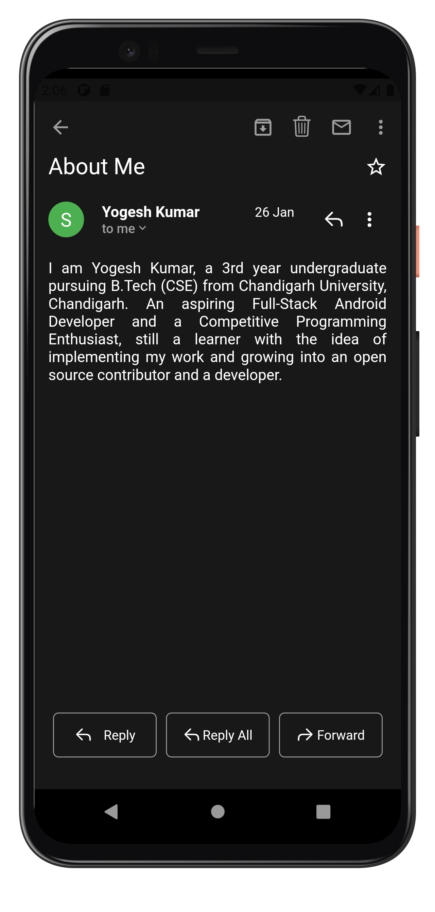 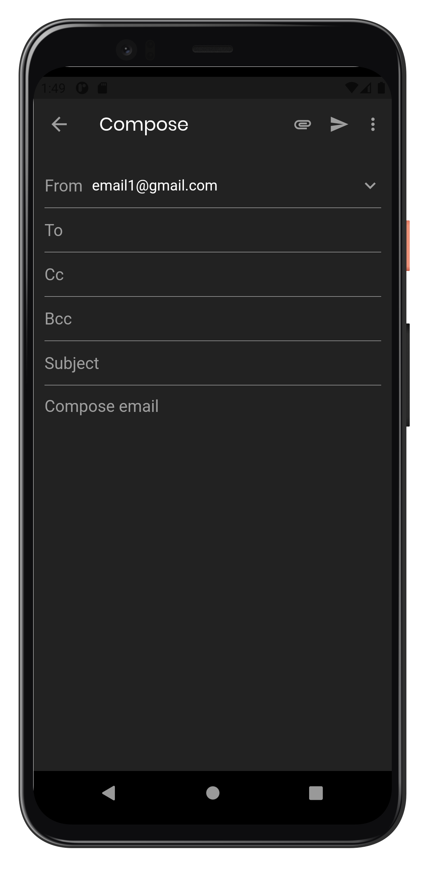 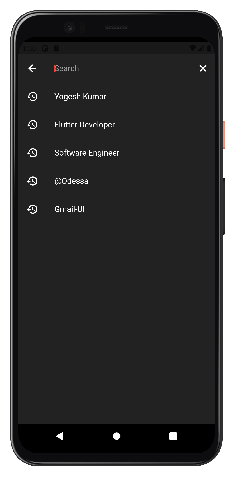

### Light mode

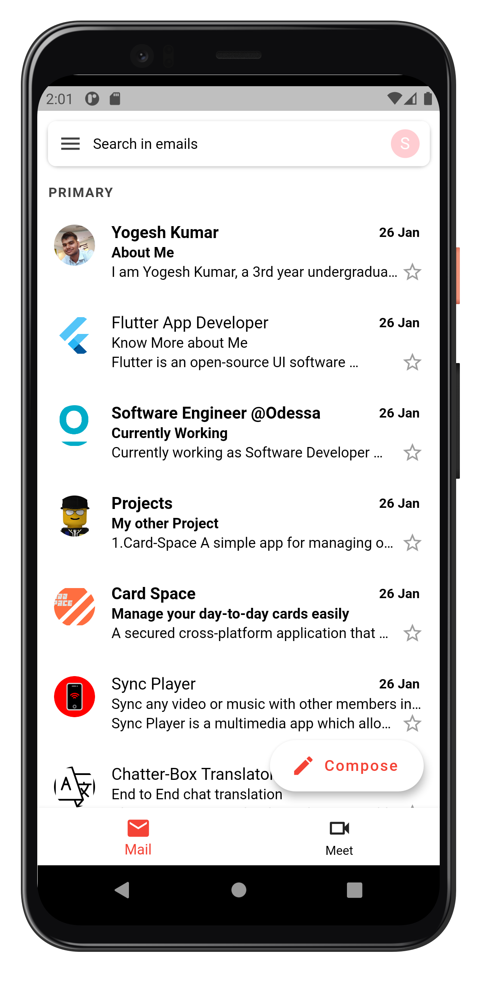 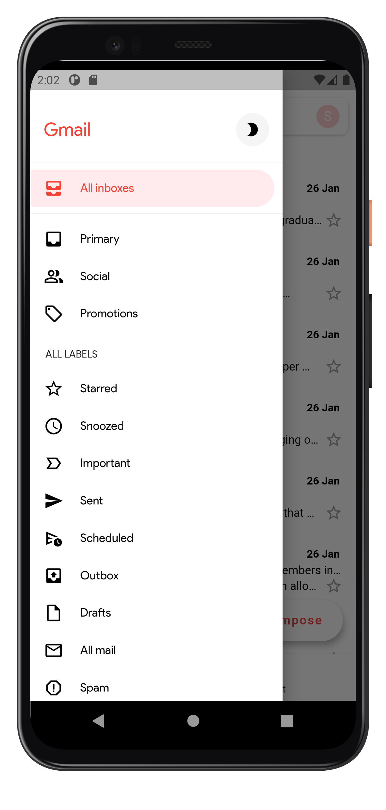 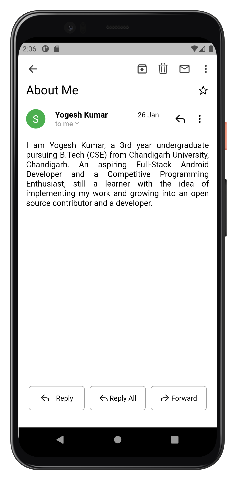 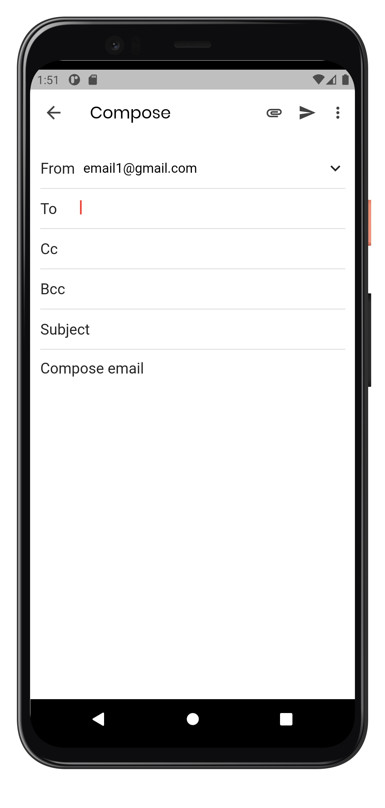 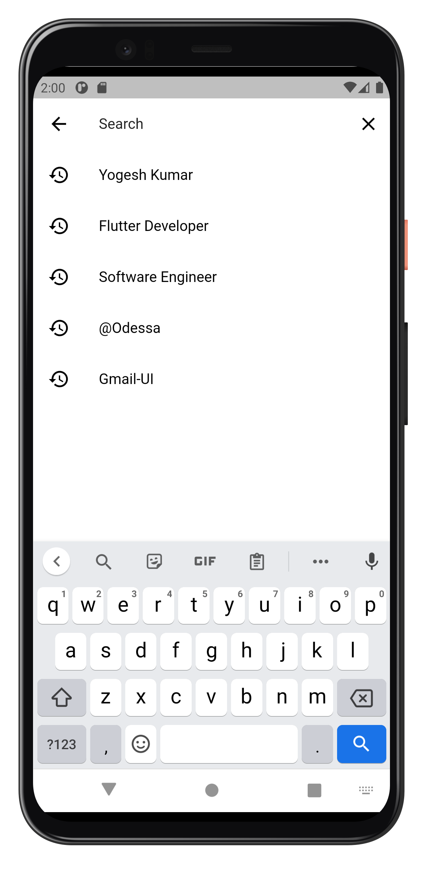

## Project setup

**Step 1:**
Download or clone this repo by using the link below:

```
https://github.com/Yogeshk4124/Card-Space.git
```

**Step 2:**
Go to project root and execute the following command in console to get the required dependencies:

```
flutter pub get
```

**Step 3:**
Run the project in Android Studio or any IDE you prefer or run the command:

```
flutter run <DART_FILE> or Run the project in android studio
```

**Step 4:**
To build the flutter project:

```
flutter build
```

## Pull Requests

I welcome and encourage all pull requests. Here are some basic rules to follow to ensure timely addition of your request:

1. Match coding style (braces, spacing, etc.) This is best achieved using `Reformat Code` feature of Android Studio `CMD`+`Option`+`L` on Mac and `CTRL` + `ALT` + `L` on Linux + Windows .
2. If its a feature, bug fix, or anything please only change code to what you specify.
3. Please keep PR titles easy to read and descriptive of changes, this will make them easier to merge :)
4. Pull requests _must_ be made against `develop` branch. Any other branch (unless specified by the maintainers) will get rejected.
5. Check for existing [issues](https://github.com/Yogeshk4124/Gmail-ui-clone/issues) first, before filing an issue.
6. Make sure you follow the set standard as all other projects in this repo do
7. Have fun!<br>

## 👍 Contribution

1. Fork it
2. Create your feature branch (git checkout -b my-new-feature)
3. Commit your changes (git commit -m 'Add some feature')
4. Push to the branch (git push origin my-new-feature)
5. Create new Pull Request

### Show some :heart: and star the repository to support the project

For more contact me @[Gmail](mailto::yogeshk4124@gmail.com),

## Facing Any Problem or need any Help:grey_question:

In case you face any problem or need any help write me in [issues](https://github.com/Yogeshk4124/Gmail-ui-clone/issues) section.
